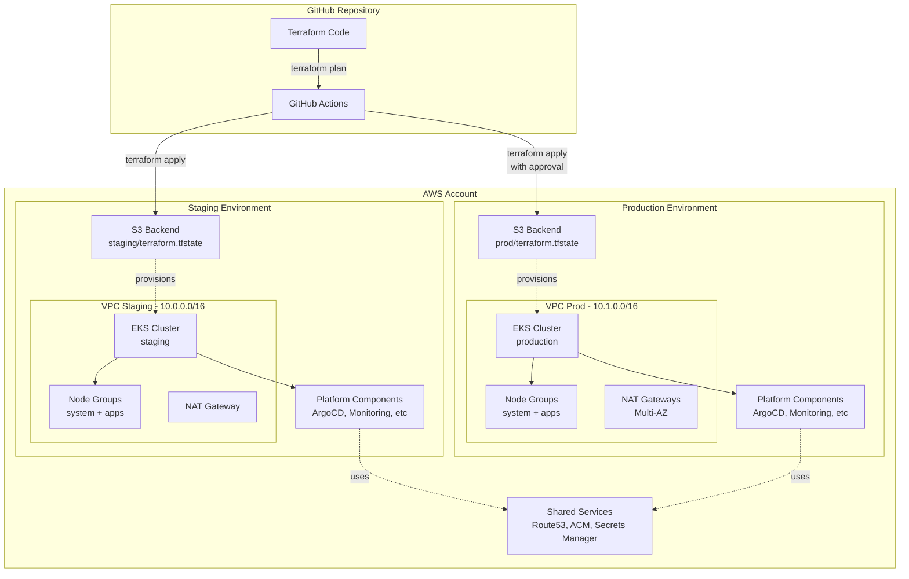

# Design Document: Template Terraform EKS AWS

## Visão Geral

Este documento descreve o design técnico de um template Terraform para provisionamento de clusters Kubernetes (EKS) production-ready na AWS. O template implementa uma arquitetura modular e reutilizável que suporta múltiplos ambientes isolados, seguindo as melhores práticas de infraestrutura como código, segurança e operabilidade.

### Objetivos do Design

- Fornecer template reutilizável para provisionamento rápido de clusters EKS
- Implementar isolamento completo entre ambientes (staging, prod)
- Seguir melhores práticas de segurança AWS e Kubernetes
- Habilitar GitOps como metodologia de deployment
- Fornecer plataforma Kubernetes padronizada com componentes essenciais
- Minimizar custos através de configurações otimizadas por ambiente
- Garantir rastreabilidade e auditoria de mudanças

### Princípios de Design

1. **Modularidade**: Componentes reutilizáveis e composíveis
2. **Isolamento**: Ambientes completamente independentes
3. **Segurança por Padrão**: Controles de segurança habilitados desde o início
4. **Observabilidade**: Monitoramento e logging integrados
5. **Automação**: CI/CD para validação e deployment
6. **Documentação**: Código auto-documentado e exemplos claros

## Arquitetura

### Estrutura de Diretórios

```
terraform-eks-aws-template/
├── modules/
│   ├── clusters/
│   │   └── eks/
│   │       ├── main.tf
│   │       ├── variables.tf
│   │       ├── outputs.tf
│   │       ├── vpc.tf
│   │       ├── eks.tf
│   │       ├── node_groups.tf
│   │       ├── irsa.tf
│   │       └── README.md
│   └── platform/
│       ├── argocd/
│       ├── policy-engine/
│       ├── external-secrets/
│       ├── observability/
│       ├── ingress/
│       └── velero/
├── live/
│   └── aws/
│       ├── staging/
│       │   ├── backend.tf
│       │   ├── main.tf
│       │   ├── variables.tf
│       │   ├── terraform.tfvars
│       │   └── outputs.tf
│       └── prod/
│           ├── backend.tf
│           ├── main.tf
│           ├── variables.tf
│           ├── terraform.tfvars
│           └── outputs.tf
├── .github/
│   └── workflows/
│       ├── terraform-plan.yml
│       └── terraform-apply.yml
├── docs/
│   ├── architecture.md
│   ├── troubleshooting.md
│   └── cost-optimization.md
└── README.md
```


### Diagrama de Arquitetura



### Fluxo de Provisionamento

1. **Inicialização do Backend**: Configuração do S3 bucket com locking nativo
2. **Provisionamento de Rede**: Criação de VPC, subnets, NAT gateways, VPC endpoints
3. **Criação do Cluster EKS**: Control plane, security groups, IRSA, KMS
4. **Provisionamento de Node Groups**: System nodes (com taints) e app nodes
5. **Bootstrap da Plataforma**: Instalação do ArgoCD via Terraform
6. **GitOps Takeover**: Restante dos componentes gerenciados pelo ArgoCD

## Componentes e Interfaces

### Módulo: clusters/eks

Módulo principal responsável por provisionar um cluster EKS completo com toda infraestrutura de rede.

#### Variáveis de Entrada

```hcl
variable "cluster_name" {
  description = "Nome do cluster EKS"
  type        = string
}

variable "cluster_version" {
  description = "Versão do Kubernetes"
  type        = string
  default     = "1.28"
}

variable "vpc_cidr" {
  description = "CIDR block para a VPC"
  type        = string
}

variable "availability_zones" {
  description = "Lista de AZs para distribuir recursos"
  type        = list(string)
}

variable "enable_nat_gateway" {
  description = "Habilitar NAT Gateway para subnets privadas"
  type        = bool
  default     = true
}

variable "single_nat_gateway" {
  description = "Usar apenas um NAT Gateway (economia de custos)"
  type        = bool
  default     = false
}

variable "enable_vpc_endpoints" {
  description = "Criar VPC endpoints para serviços AWS"
  type        = bool
  default     = true
}

variable "enable_control_plane_logs" {
  description = "Habilitar logs do control plane"
  type        = bool
  default     = true
}

variable "control_plane_log_types" {
  description = "Tipos de logs do control plane"
  type        = list(string)
  default     = ["api", "audit", "authenticator", "controllerManager", "scheduler"]
}

variable "enable_secrets_encryption" {
  description = "Habilitar criptografia de secrets com KMS"
  type        = bool
  default     = true
}

variable "node_groups" {
  description = "Configuração dos node groups"
  type = map(object({
    instance_types = list(string)
    min_size       = number
    max_size       = number
    desired_size   = number
    disk_size      = number
    labels         = map(string)
    taints = list(object({
      key    = string
      value  = string
      effect = string
    }))
  }))
}

variable "tags" {
  description = "Tags para aplicar em todos os recursos"
  type        = map(string)
  default     = {}
}
```

#### Outputs

```hcl
output "cluster_id" {
  description = "ID do cluster EKS"
  value       = aws_eks_cluster.main.id
}

output "cluster_endpoint" {
  description = "Endpoint do cluster EKS"
  value       = aws_eks_cluster.main.endpoint
}

output "cluster_certificate_authority_data" {
  description = "Dados do certificado CA do cluster"
  value       = aws_eks_cluster.main.certificate_authority[0].data
  sensitive   = true
}

output "cluster_oidc_issuer_url" {
  description = "URL do OIDC provider para IRSA"
  value       = aws_eks_cluster.main.identity[0].oidc[0].issuer
}

output "oidc_provider_arn" {
  description = "ARN do OIDC provider"
  value       = aws_iam_openid_connect_provider.eks.arn
}

output "vpc_id" {
  description = "ID da VPC criada"
  value       = aws_vpc.main.id
}

output "private_subnet_ids" {
  description = "IDs das subnets privadas"
  value       = aws_subnet.private[*].id
}

output "node_security_group_id" {
  description = "ID do security group dos nodes"
  value       = aws_security_group.node.id
}
```


### Módulo: platform/argocd

Módulo para instalação do ArgoCD via Helm.

#### Variáveis de Entrada

```hcl
variable "cluster_name" {
  description = "Nome do cluster EKS"
  type        = string
}

variable "namespace" {
  description = "Namespace para instalar ArgoCD"
  type        = string
  default     = "argocd"
}

variable "chart_version" {
  description = "Versão do Helm chart do ArgoCD"
  type        = string
  default     = "5.51.0"
}

variable "values" {
  description = "Valores customizados para o Helm chart"
  type        = any
  default     = {}
}

variable "node_selector" {
  description = "Node selector para pods do ArgoCD"
  type        = map(string)
  default     = { "role" = "system" }
}

variable "tolerations" {
  description = "Tolerations para pods do ArgoCD"
  type        = list(any)
  default = [{
    key      = "CriticalAddonsOnly"
    operator = "Equal"
    value    = "true"
    effect   = "NoSchedule"
  }]
}
```

#### Outputs

```hcl
output "namespace" {
  description = "Namespace onde ArgoCD foi instalado"
  value       = kubernetes_namespace.argocd.metadata[0].name
}

output "server_service_name" {
  description = "Nome do service do ArgoCD server"
  value       = "argocd-server"
}

output "initial_admin_password_secret" {
  description = "Nome do secret com senha inicial do admin"
  value       = "argocd-initial-admin-secret"
}
```

### Módulo: platform/policy-engine

Módulo para instalação de policy engine (Kyverno ou Gatekeeper).

#### Variáveis de Entrada

```hcl
variable "engine" {
  description = "Policy engine a usar (kyverno ou gatekeeper)"
  type        = string
  default     = "kyverno"
  
  validation {
    condition     = contains(["kyverno", "gatekeeper"], var.engine)
    error_message = "Engine deve ser 'kyverno' ou 'gatekeeper'"
  }
}

variable "enforcement_mode" {
  description = "Modo de enforcement (audit ou enforce)"
  type        = string
  default     = "audit"
  
  validation {
    condition     = contains(["audit", "enforce"], var.enforcement_mode)
    error_message = "Modo deve ser 'audit' ou 'enforce'"
  }
}

variable "policies" {
  description = "Políticas a habilitar"
  type = object({
    block_privileged       = bool
    require_non_root       = bool
    require_resources      = bool
    block_latest_tag       = bool
    require_labels         = bool
    restrict_capabilities  = bool
  })
  default = {
    block_privileged       = true
    require_non_root       = true
    require_resources      = true
    block_latest_tag       = true
    require_labels         = false
    restrict_capabilities  = true
  }
}
```

### Módulo: platform/external-secrets

Módulo para instalação do External Secrets Operator.

#### Variáveis de Entrada

```hcl
variable "cluster_name" {
  description = "Nome do cluster EKS"
  type        = string
}

variable "oidc_provider_arn" {
  description = "ARN do OIDC provider do cluster"
  type        = string
}

variable "aws_region" {
  description = "Região AWS"
  type        = string
}

variable "secrets_manager_arns" {
  description = "Lista de ARNs de secrets no Secrets Manager que podem ser acessados"
  type        = list(string)
  default     = ["*"]
}

variable "ssm_parameter_arns" {
  description = "Lista de ARNs de parâmetros no SSM que podem ser acessados"
  type        = list(string)
  default     = ["*"]
}
```

#### Outputs

```hcl
output "service_account_role_arn" {
  description = "ARN da IAM role para service account"
  value       = aws_iam_role.external_secrets.arn
}

output "cluster_secret_store_name" {
  description = "Nome do ClusterSecretStore criado"
  value       = "aws-secrets-manager"
}
```

### Módulo: platform/observability

Módulo para instalação do stack de observabilidade.

#### Variáveis de Entrada

```hcl
variable "environment" {
  description = "Ambiente (staging, prod)"
  type        = string
}

variable "prometheus_retention_days" {
  description = "Dias de retenção de métricas no Prometheus"
  type        = number
}

variable "loki_retention_days" {
  description = "Dias de retenção de logs no Loki"
  type        = number
}

variable "grafana_admin_password" {
  description = "Senha do admin do Grafana"
  type        = string
  sensitive   = true
}

variable "storage_class" {
  description = "Storage class para persistent volumes"
  type        = string
  default     = "gp3"
}

variable "prometheus_storage_size" {
  description = "Tamanho do volume para Prometheus"
  type        = string
  default     = "50Gi"
}

variable "loki_storage_size" {
  description = "Tamanho do volume para Loki"
  type        = string
  default     = "100Gi"
}
```

### Módulo: platform/ingress

Módulo para instalação de ingress controller e componentes relacionados.

#### Variáveis de Entrada

```hcl
variable "ingress_type" {
  description = "Tipo de ingress controller (alb ou nginx)"
  type        = string
  default     = "alb"
  
  validation {
    condition     = contains(["alb", "nginx"], var.ingress_type)
    error_message = "Tipo deve ser 'alb' ou 'nginx'"
  }
}

variable "cluster_name" {
  description = "Nome do cluster EKS"
  type        = string
}

variable "oidc_provider_arn" {
  description = "ARN do OIDC provider do cluster"
  type        = string
}

variable "vpc_id" {
  description = "ID da VPC"
  type        = string
}

variable "route53_zone_id" {
  description = "ID da zona Route53 para external-dns"
  type        = string
}

variable "domain_name" {
  description = "Nome de domínio base"
  type        = string
}

variable "cert_manager_email" {
  description = "Email para Let's Encrypt"
  type        = string
}
```

### Módulo: platform/velero

Módulo para instalação do Velero para backup.

#### Variáveis de Entrada

```hcl
variable "cluster_name" {
  description = "Nome do cluster EKS"
  type        = string
}

variable "oidc_provider_arn" {
  description = "ARN do OIDC provider do cluster"
  type        = string
}

variable "aws_region" {
  description = "Região AWS"
  type        = string
}

variable "backup_schedule" {
  description = "Schedule cron para backups"
  type        = string
}

variable "backup_retention_days" {
  description = "Dias de retenção de backups"
  type        = number
}

variable "backup_bucket_name" {
  description = "Nome do bucket S3 para backups (será criado)"
  type        = string
}
```


## Modelos de Dados

### Configuração de Backend S3

```hcl
terraform {
  backend "s3" {
    bucket         = "terraform-state-eks-template"
    key            = "staging/terraform.tfstate"  # ou "prod/terraform.tfstate"
    region         = "us-east-1"
    encrypt        = true
    use_lockfile   = true  # Locking nativo do S3
    
    # Tags para o objeto de state
    dynamodb_table = null  # Não usar DynamoDB
  }
}
```

### Configuração de Node Groups

```hcl
# Exemplo para staging
node_groups = {
  system = {
    instance_types = ["t3.medium"]
    min_size       = 2
    max_size       = 3
    desired_size   = 2
    disk_size      = 50
    labels = {
      role = "system"
    }
    taints = [{
      key    = "CriticalAddonsOnly"
      value  = "true"
      effect = "NoSchedule"
    }]
  }
  
  apps = {
    instance_types = ["t3.large"]
    min_size       = 2
    max_size       = 10
    desired_size   = 3
    disk_size      = 100
    labels = {
      role = "apps"
    }
    taints = []
  }
}

# Exemplo para prod
node_groups = {
  system = {
    instance_types = ["t3.large"]
    min_size       = 3
    max_size       = 5
    desired_size   = 3
    disk_size      = 100
    labels = {
      role = "system"
    }
    taints = [{
      key    = "CriticalAddonsOnly"
      value  = "true"
      effect = "NoSchedule"
    }]
  }
  
  apps = {
    instance_types = ["m5.xlarge", "m5.2xlarge"]
    min_size       = 5
    max_size       = 50
    desired_size   = 10
    disk_size      = 200
    labels = {
      role = "apps"
    }
    taints = []
  }
}
```

### Estrutura de Tags

```hcl
tags = {
  Environment = "staging"  # ou "prod"
  ManagedBy   = "Terraform"
  Project     = "eks-template"
  Owner       = "platform-team"
  CostCenter  = "engineering"
}
```

### Configuração de IRSA (IAM Role for Service Account)

```hcl
# Estrutura de trust policy para IRSA
data "aws_iam_policy_document" "irsa_trust" {
  statement {
    effect = "Allow"
    
    principals {
      type        = "Federated"
      identifiers = [var.oidc_provider_arn]
    }
    
    actions = ["sts:AssumeRoleWithWebIdentity"]
    
    condition {
      test     = "StringEquals"
      variable = "${replace(var.oidc_issuer_url, "https://", "")}:sub"
      values   = ["system:serviceaccount:${var.namespace}:${var.service_account_name}"]
    }
    
    condition {
      test     = "StringEquals"
      variable = "${replace(var.oidc_issuer_url, "https://", "")}:aud"
      values   = ["sts.amazonaws.com"]
    }
  }
}
```

### Configuração de VPC Endpoints

```hcl
vpc_endpoints = {
  ecr_api = {
    service             = "ecr.api"
    private_dns_enabled = true
    subnet_ids          = aws_subnet.private[*].id
  }
  
  ecr_dkr = {
    service             = "ecr.dkr"
    private_dns_enabled = true
    subnet_ids          = aws_subnet.private[*].id
  }
  
  sts = {
    service             = "sts"
    private_dns_enabled = true
    subnet_ids          = aws_subnet.private[*].id
  }
  
  logs = {
    service             = "logs"
    private_dns_enabled = true
    subnet_ids          = aws_subnet.private[*].id
  }
  
  ssm = {
    service             = "ssm"
    private_dns_enabled = true
    subnet_ids          = aws_subnet.private[*].id
  }
}
```

### Configuração de Políticas de Segurança (Kyverno)

```yaml
# Exemplo de política: bloquear containers privilegiados
apiVersion: kyverno.io/v1
kind: ClusterPolicy
metadata:
  name: disallow-privileged-containers
  annotations:
    policies.kyverno.io/title: Disallow Privileged Containers
    policies.kyverno.io/severity: high
spec:
  validationFailureAction: ${enforcement_mode}  # audit ou enforce
  background: true
  rules:
  - name: privileged-containers
    match:
      any:
      - resources:
          kinds:
          - Pod
    validate:
      message: "Privileged mode is not allowed"
      pattern:
        spec:
          containers:
          - =(securityContext):
              =(privileged): false
```


## Propriedades de Corretude

*Uma propriedade é uma característica ou comportamento que deve ser verdadeiro em todas as execuções válidas de um sistema - essencialmente, uma declaração formal sobre o que o sistema deve fazer. Propriedades servem como ponte entre especificações legíveis por humanos e garantias de corretude verificáveis por máquina.*

### Reflexão sobre Propriedades

Após análise dos 108 critérios de aceitação, identifiquei as seguintes oportunidades de consolidação:

- Critérios 1.1, 1.2, 1.3 e 1.4 podem ser combinados em uma propriedade de isolamento de ambientes
- Critérios 4.1, 4.2, 4.5 e 4.6 sobre VPC podem ser consolidados em propriedades de rede
- Critérios 6.3, 6.4, 6.5 e 6.6 sobre node groups podem ser combinados em propriedade de configuração completa
- Critérios 8.2, 8.3, 8.4 e 8.5 sobre políticas podem ser consolidados em propriedade de políticas habilitadas
- Critérios 10.4 e 10.5 sobre retenção podem ser combinados em uma propriedade
- Critérios 15.3 e 15.4 sobre documentação podem ser consolidados
- Critérios 17.1 e 18.6 sobre tags podem ser combinados

### Propriedades Universais

**Propriedade 1: Isolamento de Ambientes**
*Para qualquer* par de ambientes distintos (staging, prod), cada ambiente deve ter state file S3 em path único, VPC com CIDR único e cluster EKS com nome único.
**Valida: Requisitos 1.1, 1.2, 1.3, 1.4**

**Propriedade 2: Subnets Multi-AZ**
*Para qualquer* configuração de VPC com N zonas de disponibilidade (N ≥ 2), o módulo deve criar exatamente N subnets privadas e N subnets públicas, uma em cada AZ.
**Valida: Requisitos 4.1, 4.2**

**Propriedade 3: NAT Gateway por AZ**
*Para qualquer* configuração com enable_nat_gateway=true e single_nat_gateway=false e N AZs, o módulo deve criar exatamente N NAT gateways.
**Valida: Requisitos 4.3**

**Propriedade 4: VPC Endpoints Completos**
*Para qualquer* configuração com enable_vpc_endpoints=true, o módulo deve criar endpoints para todos os serviços obrigatórios: ecr.api, ecr.dkr, sts, logs e ssm.
**Valida: Requisitos 4.4**

**Propriedade 5: Tags Kubernetes em Subnets**
*Para qualquer* subnet criada, ela deve conter tags no formato `kubernetes.io/cluster/<cluster_name>` para descoberta automática.
**Valida: Requisitos 4.6**

**Propriedade 6: Logs do Control Plane Completos**
*Para qualquer* cluster com enable_control_plane_logs=true, todos os 5 tipos de log (api, audit, authenticator, controllerManager, scheduler) devem estar habilitados.
**Valida: Requisitos 5.1**

**Propriedade 7: Criptografia de Secrets com KMS**
*Para qualquer* cluster com enable_secrets_encryption=true, deve existir uma chave KMS dedicada e encryption_config configurado para o recurso "secrets".
**Valida: Requisitos 5.2**

**Propriedade 8: Versão Kubernetes Válida**
*Para qualquer* configuração de cluster, a versão do Kubernetes deve estar no formato "X.YY" onde X é 1 e YY é um número entre 24 e 30.
**Valida: Requisitos 5.5**

**Propriedade 9: Node Groups Completos**
*Para qualquer* node group configurado, ele deve ter todos os campos obrigatórios: instance_types, min_size, max_size, desired_size, disk_size e labels.
**Valida: Requisitos 6.3, 6.4, 6.5, 6.6**

**Propriedade 10: Autoscaling Conservador para System Nodes**
*Para qualquer* node group com label role=system, a diferença entre max_size e min_size deve ser ≤ 3.
**Valida: Requisitos 6.7**

**Propriedade 11: Políticas de Segurança Habilitadas**
*Para qualquer* configuração de policy engine com policies.block_privileged=true, policies.require_non_root=true, policies.require_resources=true e policies.block_latest_tag=true, devem existir 4 políticas correspondentes no código.
**Valida: Requisitos 8.2, 8.3, 8.4, 8.5**

**Propriedade 12: IRSA com Permissões Corretas**
*Para qualquer* módulo de plataforma que cria IRSA role (external-secrets, ingress, velero), a role deve ter trust policy com OIDC provider e condition StringEquals para namespace e service account.
**Valida: Requisitos 9.1, 11.2, 11.4, 12.2**

**Propriedade 13: Retenção por Ambiente**
*Para qualquer* configuração de observabilidade, se environment="staging" então prometheus_retention_days=7 e loki_retention_days=3; se environment="prod" então prometheus_retention_days=30 e loki_retention_days=15.
**Valida: Requisitos 10.4, 10.5**

**Propriedade 14: Backup Schedule por Ambiente**
*Para qualquer* configuração de Velero, se environment="staging" então backup_schedule="0 2 * * *" (diário) e backup_retention_days=7; se environment="prod" então backup_schedule="0 */6 * * *" (6h) e backup_retention_days=30.
**Valida: Requisitos 12.3, 12.4**

**Propriedade 15: Documentação de Variáveis e Outputs**
*Para qualquer* módulo Terraform, todas as variáveis em variables.tf devem ter campo "description" não-vazio e todos os outputs em outputs.tf devem ter campo "description" não-vazio.
**Valida: Requisitos 3.5, 15.3, 15.4**

**Propriedade 16: Tags Obrigatórias**
*Para qualquer* recurso AWS criado, ele deve ter as tags obrigatórias: Environment, ManagedBy, Project, Owner e Purpose.
**Valida: Requisitos 17.1, 18.6**

**Propriedade 17: Bucket Policies de Proteção**
*Para qualquer* bucket S3 usado para logs ou backups, deve existir bucket policy com statement que nega ações s3:DeleteBucket e s3:DeleteObject.
**Valida: Requisitos 18.5**

### Exemplos Específicos

**Exemplo 1: Backend S3 com Locking Nativo**
O arquivo backend.tf deve conter:
```hcl
backend "s3" {
  use_lockfile = true
  encrypt      = true
}
```
E NÃO deve conter `dynamodb_table`.
**Valida: Requisitos 2.1, 2.3, 2.4**

**Exemplo 2: Bucket S3 com Versionamento**
Deve existir recurso `aws_s3_bucket_versioning` com `status = "Enabled"` para o bucket de state.
**Valida: Requisitos 2.2**

**Exemplo 3: Estrutura de Diretórios**
Devem existir os seguintes diretórios:
- `modules/clusters/eks/`
- `modules/platform/`
- `live/aws/staging/`
- `live/aws/prod/`
**Valida: Requisitos 3.1, 3.2, 3.3**

**Exemplo 4: Node Group System com Taint**
O node group "system" deve ter configuração:
```hcl
taints = [{
  key    = "CriticalAddonsOnly"
  value  = "true"
  effect = "NoSchedule"
}]
```
**Valida: Requisitos 6.1**

**Exemplo 5: Node Group Apps sem Taints**
O node group "apps" deve ter `taints = []`.
**Valida: Requisitos 6.2**

**Exemplo 6: ArgoCD com Helm Provider**
Deve existir recurso `helm_release` com `chart = "argo-cd"` no módulo platform/argocd.
**Valida: Requisitos 7.1**

**Exemplo 7: Namespace Dedicado para ArgoCD**
Deve existir recurso `kubernetes_namespace` com `metadata.name = "argocd"`.
**Valida: Requisitos 7.2**

**Exemplo 8: Tolerations para ArgoCD**
Os values do Helm chart devem incluir tolerations para o taint CriticalAddonsOnly.
**Valida: Requisitos 7.3**

**Exemplo 9: Outputs do ArgoCD**
O módulo argocd deve ter outputs: namespace, server_service_name, initial_admin_password_secret.
**Valida: Requisitos 7.4**

**Exemplo 10: Variável de Seleção de Policy Engine**
Deve existir variável `engine` com validation que aceita apenas "kyverno" ou "gatekeeper".
**Valida: Requisitos 8.1**

**Exemplo 11: Enforcement Mode por Ambiente**
Para staging: `enforcement_mode = "audit"`
Para prod: `enforcement_mode = "enforce"`
**Valida: Requisitos 8.6, 8.7**

**Exemplo 12: ClusterSecretStore para AWS**
Deve existir recurso Kubernetes `ClusterSecretStore` com backend AWS Secrets Manager.
**Valida: Requisitos 9.2**

**Exemplo 13: Variável AWS Region**
Módulo external-secrets deve ter variável `aws_region` do tipo string.
**Valida: Requisitos 9.3**

**Exemplo 14: Namespace para External Secrets**
Deve existir namespace dedicado para external-secrets-operator.
**Valida: Requisitos 9.4**

**Exemplo 15: Exemplo de ExternalSecret**
Deve existir arquivo de exemplo mostrando uso de ExternalSecret.
**Valida: Requisitos 9.5**

**Exemplo 16: Kube-Prometheus-Stack**
Deve existir `helm_release` para kube-prometheus-stack.
**Valida: Requisitos 10.1**

**Exemplo 17: Loki**
Deve existir `helm_release` para loki.
**Valida: Requisitos 10.2**

**Exemplo 18: OpenTelemetry Collector**
Deve existir `helm_release` para opentelemetry-collector.
**Valida: Requisitos 10.3**

**Exemplo 19: Outputs de Observabilidade**
Módulo observability deve ter outputs: grafana_endpoint, prometheus_endpoint.
**Valida: Requisitos 10.7**

**Exemplo 20: Variável de Seleção de Ingress**
Deve existir variável `ingress_type` com validation que aceita apenas "alb" ou "nginx".
**Valida: Requisitos 11.1**

**Exemplo 21: ClusterIssuer Let's Encrypt**
Deve existir recurso `ClusterIssuer` configurado para Let's Encrypt.
**Valida: Requisitos 11.3**

**Exemplo 22: Variável Route53 Zone**
Módulo ingress deve ter variável `route53_zone_id`.
**Valida: Requisitos 11.5**

**Exemplo 23: Exemplo de Ingress**
Deve existir arquivo de exemplo mostrando Ingress com anotações apropriadas.
**Valida: Requisitos 11.6**

**Exemplo 24: Bucket S3 para Velero**
Deve existir recurso `aws_s3_bucket` dedicado para backups do Velero.
**Valida: Requisitos 12.1**

**Exemplo 25: Output do Bucket de Backup**
Módulo velero deve ter output `backup_bucket_name`.
**Valida: Requisitos 12.5**

**Exemplo 26: Instance Types por Ambiente**
Staging: `instance_types = ["t3.medium", "t3.large"]`
Prod: `instance_types = ["m5.xlarge", "m5.2xlarge"]`
**Valida: Requisitos 13.1, 13.2**

**Exemplo 27: Autoscaling por Ambiente**
Staging apps: `max_size = 10`
Prod apps: `max_size = 50`
**Valida: Requisitos 13.3, 13.4**

**Exemplo 28: Arquivo terraform.tfvars por Ambiente**
Devem existir arquivos:
- `live/aws/staging/terraform.tfvars`
- `live/aws/prod/terraform.tfvars`
**Valida: Requisitos 13.7**

**Exemplo 29: GitHub Actions - Terraform Format**
Workflow deve conter step com `terraform fmt -check`.
**Valida: Requisitos 14.1**

**Exemplo 30: GitHub Actions - Terraform Validate**
Workflow deve conter step com `terraform validate`.
**Valida: Requisitos 14.2**

**Exemplo 31: GitHub Actions - Terraform Plan**
Workflow deve conter step com `terraform plan`.
**Valida: Requisitos 14.3**

**Exemplo 32: GitHub Actions - Apply Staging**
Workflow de apply deve executar automaticamente para staging após merge.
**Valida: Requisitos 14.4**

**Exemplo 33: GitHub Actions - Apply Prod com Aprovação**
Workflow de apply para prod deve ter `environment: production` com protection rules.
**Valida: Requisitos 14.5**

**Exemplo 34: GitHub Actions - OIDC AWS**
Workflow deve usar `aws-actions/configure-aws-credentials@v4` com `role-to-assume`.
**Valida: Requisitos 14.6**

**Exemplo 35: GitHub Actions - Comentário no PR**
Workflow deve ter step que posta output do plan como comentário no PR.
**Valida: Requisitos 14.7**

**Exemplo 36: README Principal**
Deve existir `README.md` na raiz com instruções de uso.
**Valida: Requisitos 15.1**

**Exemplo 37: Exemplos de terraform.tfvars**
Devem existir arquivos de exemplo para cada ambiente.
**Valida: Requisitos 15.2**

**Exemplo 38: Guia de Troubleshooting**
Deve existir `docs/troubleshooting.md`.
**Valida: Requisitos 15.5**

**Exemplo 39: Diagrama de Arquitetura**
Deve existir diagrama (Mermaid ou imagem) na documentação.
**Valida: Requisitos 15.6**

**Exemplo 40: Configuração terraform-docs**
Deve existir arquivo `.terraform-docs.yml`.
**Valida: Requisitos 16.1**

**Exemplo 41: Configuração tflint**
Deve existir arquivo `.tflint.hcl`.
**Valida: Requisitos 16.2**

**Exemplo 42: Security Scan no CI**
Workflow deve conter step com checkov ou tfsec.
**Valida: Requisitos 16.3**

**Exemplo 43: Falha em Issues Críticos**
Step de security scan deve ter configuração para falhar em severidade crítica.
**Valida: Requisitos 16.4**

**Exemplo 44: Testes Terratest**
Deve existir diretório `test/` com arquivos Go para Terratest.
**Valida: Requisitos 16.5**

**Exemplo 45: Documentação de Custos**
Deve existir `docs/cost-optimization.md` com estimativas.
**Valida: Requisitos 17.2**

**Exemplo 46: Single NAT Gateway em Staging**
Configuração staging deve ter `single_nat_gateway = true`.
**Valida: Requisitos 17.3**

**Exemplo 47: Variável Enable NAT Gateway**
Deve existir variável `enable_nat_gateway` do tipo bool.
**Valida: Requisitos 17.4**

**Exemplo 48: Documentação de Otimização**
Documentação deve incluir seção sobre Spot instances e Savings Plans.
**Valida: Requisitos 17.5**

**Exemplo 49: CloudTrail**
Deve existir recurso `aws_cloudtrail`.
**Valida: Requisitos 18.1**

**Exemplo 50: AWS Config**
Devem existir recursos `aws_config_configuration_recorder` e `aws_config_delivery_channel`.
**Valida: Requisitos 18.2**

**Exemplo 51: GuardDuty**
Deve existir recurso `aws_guardduty_detector`.
**Valida: Requisitos 18.3**


## Tratamento de Erros

### Validação de Entrada

O template deve validar entradas usando validation blocks do Terraform:

```hcl
variable "cluster_version" {
  description = "Versão do Kubernetes"
  type        = string
  
  validation {
    condition     = can(regex("^1\\.(2[4-9]|30)$", var.cluster_version))
    error_message = "Versão do Kubernetes deve estar entre 1.24 e 1.30"
  }
}

variable "environment" {
  description = "Ambiente (staging ou prod)"
  type        = string
  
  validation {
    condition     = contains(["staging", "prod"], var.environment)
    error_message = "Ambiente deve ser 'staging' ou 'prod'"
  }
}

variable "vpc_cidr" {
  description = "CIDR block para a VPC"
  type        = string
  
  validation {
    condition     = can(cidrhost(var.vpc_cidr, 0))
    error_message = "CIDR block inválido"
  }
}
```

### Tratamento de Falhas de Provisionamento

**Estratégias de Recuperação:**

1. **State Locking**: O locking nativo do S3 previne corrupção de state em execuções concorrentes
2. **Idempotência**: Todos os recursos são idempotentes - re-executar apply é seguro
3. **Rollback Manual**: Em caso de falha, usar `terraform destroy` seguido de novo `terraform apply`
4. **Backup de State**: Versionamento do S3 permite recuperar states anteriores

**Cenários de Erro Comuns:**

| Erro | Causa | Solução |
|------|-------|---------|
| Quota de VPC excedida | Limite AWS atingido | Solicitar aumento de quota ou deletar VPCs não usadas |
| Cluster já existe | Nome duplicado | Usar nome único ou destruir cluster existente |
| OIDC provider já existe | Tentativa de recriar | Importar recurso existente com `terraform import` |
| Timeout na criação do cluster | Recursos AWS lentos | Aumentar timeout ou verificar service health AWS |
| Falha na instalação do Helm | Cluster não acessível | Verificar kubeconfig e conectividade |

### Logs e Debugging

**Habilitar Logs Detalhados:**

```bash
export TF_LOG=DEBUG
export TF_LOG_PATH=terraform-debug.log
terraform apply
```

**Verificar State:**

```bash
terraform state list
terraform state show <resource>
```

**Validar Configuração:**

```bash
terraform validate
terraform fmt -check -recursive
tflint --recursive
```

## Estratégia de Testes

### Abordagem Dual de Testes

O template utiliza duas abordagens complementares:

1. **Testes Unitários**: Validam exemplos específicos, casos extremos e condições de erro
2. **Testes Baseados em Propriedades**: Verificam propriedades universais através de múltiplas entradas

Ambos são necessários para cobertura abrangente - testes unitários capturam bugs concretos, testes de propriedade verificam corretude geral.

### Testes de Validação Estática

**Ferramentas:**
- `terraform validate`: Valida sintaxe e configuração
- `terraform fmt`: Valida formatação
- `tflint`: Linting com regras AWS
- `checkov` ou `tfsec`: Análise de segurança
- `terraform-docs`: Valida documentação

**Execução:**

```bash
# Validação básica
terraform init
terraform validate

# Formatação
terraform fmt -check -recursive

# Linting
tflint --init
tflint --recursive

# Security scanning
checkov -d . --framework terraform

# Documentação
terraform-docs markdown table . --output-file README.md
```

### Testes de Integração com Terratest

**Estrutura de Testes:**

```
test/
├── eks_cluster_test.go
├── vpc_test.go
├── platform_test.go
└── go.mod
```

**Exemplo de Teste:**

```go
package test

import (
    "testing"
    "github.com/gruntwork-io/terratest/modules/terraform"
    "github.com/stretchr/testify/assert"
)

func TestEKSClusterCreation(t *testing.T) {
    terraformOptions := &terraform.Options{
        TerraformDir: "../live/aws/staging",
        Vars: map[string]interface{}{
            "cluster_name": "test-cluster",
            "vpc_cidr":     "10.100.0.0/16",
        },
    }
    
    defer terraform.Destroy(t, terraformOptions)
    terraform.InitAndApply(t, terraformOptions)
    
    clusterName := terraform.Output(t, terraformOptions, "cluster_id")
    assert.NotEmpty(t, clusterName)
}
```

### Testes Baseados em Propriedades

**Biblioteca:** Usar framework de property-based testing para Go (como `gopter`) ou Python (como `hypothesis`)

**Configuração:** Mínimo 100 iterações por teste de propriedade

**Formato de Tag:** Cada teste deve referenciar a propriedade do design:
```go
// Feature: terraform-eks-aws-template, Property 1: Isolamento de Ambientes
```

**Exemplos de Testes de Propriedade:**

```go
// Property 1: Isolamento de Ambientes
func TestPropertyEnvironmentIsolation(t *testing.T) {
    // Feature: terraform-eks-aws-template, Property 1: Isolamento de Ambientes
    // Para qualquer par de ambientes distintos, cada um deve ter recursos únicos
    
    properties := gopter.NewProperties(nil)
    properties.Property("environments have unique resources", prop.ForAll(
        func(env1, env2 string) bool {
            if env1 == env2 {
                return true // Skip same environment
            }
            
            config1 := loadConfig(env1)
            config2 := loadConfig(env2)
            
            return config1.StatePath != config2.StatePath &&
                   config1.VPCCIDR != config2.VPCCIDR &&
                   config1.ClusterName != config2.ClusterName
        },
        gen.OneConstOf("staging", "prod"),
        gen.OneConstOf("staging", "prod"),
    ))
    
    properties.TestingRun(t, gopter.ConsoleReporter(false))
}

// Property 2: Subnets Multi-AZ
func TestPropertySubnetsMultiAZ(t *testing.T) {
    // Feature: terraform-eks-aws-template, Property 2: Subnets Multi-AZ
    // Para qualquer N AZs (N >= 2), deve criar N subnets privadas e N públicas
    
    properties := gopter.NewProperties(nil)
    properties.Property("subnets match AZ count", prop.ForAll(
        func(azCount int) bool {
            config := generateVPCConfig(azCount)
            plan := terraformPlan(config)
            
            privateSubnets := countResourcesByType(plan, "aws_subnet", "private")
            publicSubnets := countResourcesByType(plan, "aws_subnet", "public")
            
            return privateSubnets == azCount && publicSubnets == azCount
        },
        gen.IntRange(2, 4), // 2 a 4 AZs
    ))
    
    properties.TestingRun(t, gopter.ConsoleReporter(false))
}

// Property 9: Node Groups Completos
func TestPropertyNodeGroupsComplete(t *testing.T) {
    // Feature: terraform-eks-aws-template, Property 9: Node Groups Completos
    // Para qualquer node group, deve ter todos os campos obrigatórios
    
    properties := gopter.NewProperties(nil)
    properties.Property("node groups have required fields", prop.ForAll(
        func(nodeGroup map[string]interface{}) bool {
            requiredFields := []string{
                "instance_types", "min_size", "max_size", 
                "desired_size", "disk_size", "labels",
            }
            
            for _, field := range requiredFields {
                if _, exists := nodeGroup[field]; !exists {
                    return false
                }
            }
            return true
        },
        genNodeGroup(), // Generator customizado
    ))
    
    properties.TestingRun(t, gopter.ConsoleReporter(false))
}
```

### Testes Unitários

**Foco:** Exemplos específicos, casos extremos, condições de erro

**Exemplos:**

```go
func TestBackendConfigHasLockfile(t *testing.T) {
    // Valida: Requisitos 2.1
    backendConfig := parseBackendConfig("../live/aws/staging/backend.tf")
    assert.True(t, backendConfig.UseLockfile)
    assert.True(t, backendConfig.Encrypt)
    assert.Empty(t, backendConfig.DynamoDBTable)
}

func TestSystemNodeGroupHasTaint(t *testing.T) {
    // Valida: Requisitos 6.1
    config := loadTerraformVars("../live/aws/staging/terraform.tfvars")
    systemNodeGroup := config.NodeGroups["system"]
    
    assert.Len(t, systemNodeGroup.Taints, 1)
    assert.Equal(t, "CriticalAddonsOnly", systemNodeGroup.Taints[0].Key)
    assert.Equal(t, "true", systemNodeGroup.Taints[0].Value)
    assert.Equal(t, "NoSchedule", systemNodeGroup.Taints[0].Effect)
}

func TestAppsNodeGroupNoTaints(t *testing.T) {
    // Valida: Requisitos 6.2
    config := loadTerraformVars("../live/aws/staging/terraform.tfvars")
    appsNodeGroup := config.NodeGroups["apps"]
    
    assert.Empty(t, appsNodeGroup.Taints)
}

func TestStagingUsesAuditMode(t *testing.T) {
    // Valida: Requisitos 8.6
    config := loadTerraformVars("../live/aws/staging/terraform.tfvars")
    assert.Equal(t, "audit", config.PolicyEngine.EnforcementMode)
}

func TestProdUsesEnforceMode(t *testing.T) {
    // Valida: Requisitos 8.7
    config := loadTerraformVars("../live/aws/prod/terraform.tfvars")
    assert.Equal(t, "enforce", config.PolicyEngine.EnforcementMode)
}
```

### Pipeline de CI/CD

**GitHub Actions Workflow:**

```yaml
name: Terraform Validation

on:
  pull_request:
    branches: [main]

jobs:
  validate:
    runs-on: ubuntu-latest
    steps:
      - uses: actions/checkout@v4
      
      - name: Setup Terraform
        uses: hashicorp/setup-terraform@v3
        
      - name: Terraform Format
        run: terraform fmt -check -recursive
        
      - name: Terraform Init
        run: |
          cd live/aws/staging
          terraform init -backend=false
          
      - name: Terraform Validate
        run: |
          cd live/aws/staging
          terraform validate
          
      - name: TFLint
        uses: terraform-linters/setup-tflint@v4
        run: tflint --recursive
        
      - name: Security Scan
        uses: bridgecrewio/checkov-action@master
        with:
          directory: .
          framework: terraform
          soft_fail: false
          
      - name: Run Unit Tests
        run: |
          cd test
          go test -v ./...
          
      - name: Run Property Tests
        run: |
          cd test
          go test -v -run TestProperty -count 100
```

### Cobertura de Testes

**Métricas:**
- 100% dos módulos devem ter testes unitários
- 100% das propriedades devem ter testes de propriedade
- Mínimo 80% de cobertura de código Terraform
- Todos os exemplos devem ser validados

**Relatórios:**
- Gerar relatório de cobertura com `go test -cover`
- Publicar resultados no PR como comentário
- Falhar build se cobertura < 80%

