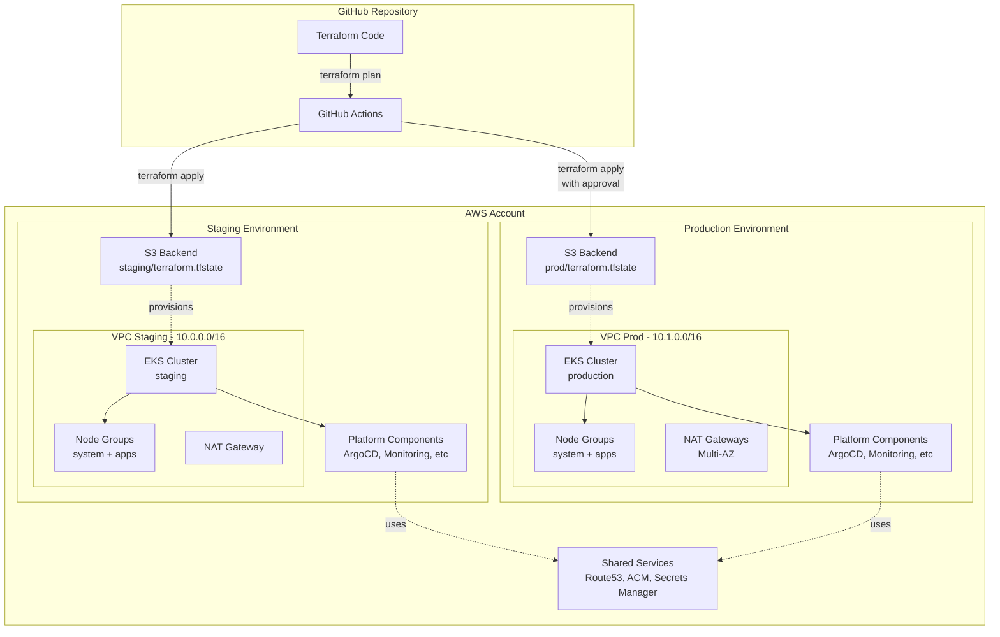

# Arquitetura do Template Terraform EKS AWS

## Visão Geral

Este documento descreve a arquitetura do template Terraform para provisionamento de clusters EKS na AWS.

## Diagrama de Arquitetura



## Componentes Principais

### 1. Backend S3 com Locking Nativo

- **Bucket S3**: Armazena o state do Terraform
- **Versionamento**: Habilitado para histórico de mudanças
- **Criptografia**: Server-side encryption (SSE-S3)
- **Locking**: Nativo do S3 (`use_lockfile = true`)
- **Isolamento**: Paths separados por ambiente

**Benefícios:**
- Sem dependência do DynamoDB
- Simplificação da infraestrutura
- Redução de custos
- Locking automático e confiável

### 2. Isolamento de Ambientes

Cada ambiente (staging, prod) possui:
- State file isolado no S3
- VPC dedicada com CIDR único
- Cluster EKS independente
- Configurações otimizadas

### 3. Estrutura Modular

```
modules/
├── clusters/eks/     # Infraestrutura base (VPC, EKS, nodes)
└── platform/         # Componentes da plataforma Kubernetes
    ├── argocd/
    ├── policy-engine/
    ├── external-secrets/
    ├── observability/
    ├── ingress/
    └── velero/
```

**Vantagens:**
- Reutilização de código
- Manutenção simplificada
- Testes isolados
- Composição flexível

### 4. Rede VPC Production-Ready

**Componentes:**
- Subnets privadas (workloads)
- Subnets públicas (NAT gateways, load balancers)
- NAT Gateways (single em staging, multi-AZ em prod)
- VPC Endpoints (ECR, STS, CloudWatch, SSM)
- Route tables configuradas
- Security groups restritivos

**Topologia:**
```
VPC (10.0.0.0/16 ou 10.1.0.0/16)
├── Public Subnets (10.x.0.0/20, 10.x.16.0/20, 10.x.32.0/20)
│   └── NAT Gateways
└── Private Subnets (10.x.48.0/20, 10.x.64.0/20, 10.x.80.0/20)
    └── EKS Nodes
```

### 5. Cluster EKS Seguro

**Características:**
- Versão Kubernetes configurável (1.24-1.30)
- Logs do control plane habilitados (5 tipos)
- Criptografia de secrets com KMS
- IRSA (IAM Roles for Service Accounts)
- Security groups restritivos
- Endpoint privado ou com restrições de CIDR

### 6. Node Groups Otimizados

**System Node Group:**
- Taint: `CriticalAddonsOnly=true:NoSchedule`
- Para componentes críticos da plataforma
- Autoscaling conservador
- Instance types menores

**Apps Node Group:**
- Sem taints
- Para workloads de aplicação
- Autoscaling agressivo
- Instance types maiores

### 7. Plataforma Kubernetes

**Bootstrap (via Terraform):**
- ArgoCD: GitOps engine

**Gerenciado via GitOps:**
- Policy Engine (Kyverno/Gatekeeper)
- External Secrets Operator
- Observability Stack (Prometheus, Grafana, Loki)
- Ingress Controller (ALB/nginx)
- Velero (backup)

## Fluxo de Provisionamento

1. **Inicialização**: `terraform init` configura backend S3
2. **Rede**: Criação de VPC, subnets, NAT, endpoints
3. **Cluster**: Provisionamento do EKS com segurança
4. **Nodes**: Criação de node groups (system e apps)
5. **Bootstrap**: Instalação do ArgoCD via Terraform
6. **GitOps**: Restante gerenciado pelo ArgoCD

## Segurança

### Camadas de Segurança

1. **Infraestrutura**
   - VPC isolada
   - Security groups restritivos
   - VPC endpoints (tráfego privado)
   - NAT gateways (saída controlada)

2. **Cluster**
   - Criptografia de secrets (KMS)
   - Logs de auditoria
   - IRSA (least privilege)
   - Endpoint privado

3. **Workloads**
   - Policy engine (Kyverno/Gatekeeper)
   - Network policies
   - Pod security standards
   - Resource quotas

4. **Compliance**
   - CloudTrail (auditoria)
   - AWS Config (compliance)
   - GuardDuty (detecção de ameaças)

## Alta Disponibilidade

### Staging
- 2-3 AZs
- Single NAT gateway (economia)
- Autoscaling conservador
- Retenção reduzida

### Production
- 3 AZs
- NAT gateway por AZ
- Autoscaling agressivo
- Retenção estendida
- Backups frequentes

## Observabilidade

**Métricas:**
- Prometheus (coleta)
- Grafana (visualização)
- Alertmanager (alertas)

**Logs:**
- Loki (agregação)
- CloudWatch (control plane)

**Traces:**
- OpenTelemetry Collector

## Disaster Recovery

**Backup:**
- Velero para recursos Kubernetes
- Snapshots de volumes EBS
- Versionamento de state S3

**Retenção:**
- Staging: 7 dias
- Production: 30 dias

**RTO/RPO:**
- RTO: < 4 horas
- RPO: < 6 horas (prod), < 24 horas (staging)

## Custos

### Otimizações

**Staging:**
- Single NAT gateway
- Instance types menores
- Autoscaling conservador
- Retenção reduzida

**Production:**
- Multi-AZ para HA
- Instance types otimizados
- Savings Plans / Reserved Instances
- Spot instances para workloads tolerantes

### Estimativas

Consulte o [guia de otimização de custos](cost-optimization.md) para detalhes.

## Próximos Passos

1. Implementar módulo clusters/eks (Tarefa 2)
2. Adicionar node groups (Tarefa 4)
3. Integrar módulos de plataforma (Tarefas 7-12)
4. Configurar CI/CD (Tarefa 17)
5. Documentação completa (Tarefa 18)

## Referências

- [AWS EKS Best Practices](https://aws.github.io/aws-eks-best-practices/)
- [Terraform AWS Provider](https://registry.terraform.io/providers/hashicorp/aws/latest/docs)
- [EKS Workshop](https://www.eksworkshop.com/)
